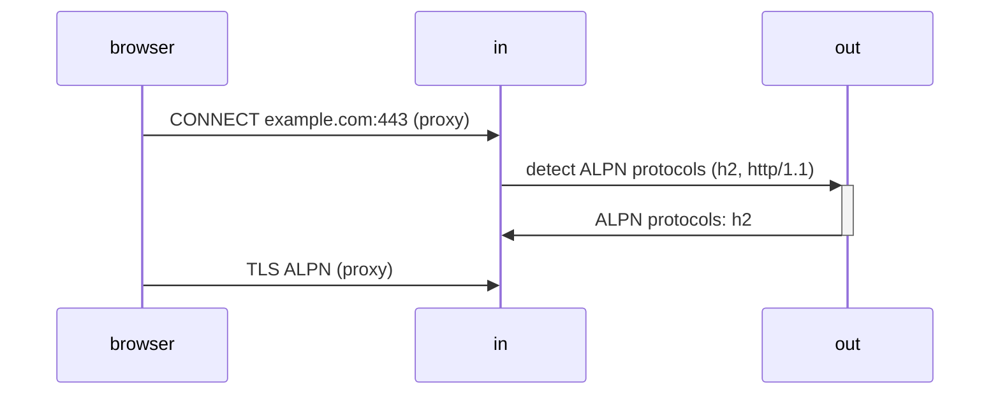

# plug2proxy

Just another awesome magic.

```js
export default {
  mode: 'in',
  tunnel: {
    authority: 'https://example.com',
    password: '',
  },
  proxy: {
    host: 'any',
    port: 8000,
  },
};
```

```js
export default {
  mode: 'out',
  match: {
    include: [
      {
        type: 'domain',
        match: ['*.twitter.com'],
      },
    ],
    exclude: [
      {
        type: 'geoip',
        match: 'CN',
      },
    ],
  },
  tunnel: {
    host: 'any',
    port: 8443,
    password: '',
  },
};
```

```js
export default 'https://gist.github.com/vilicvane/xxx';
```

## HTTP2



## License

MIT License.
