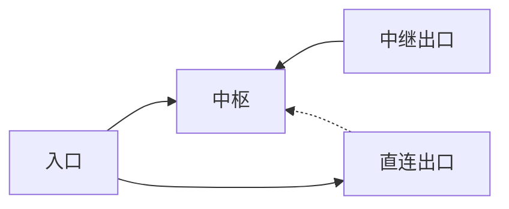

# Plug2Proxy 2

Plug2Proxy 2 是一个多节点代理工具：

```mermaid
flowchart LR
    入口 --> 中枢
    中继出口 --> 中枢
    入口 --> 直连出口
    直连出口 -.-> 中枢
    中枢 ~~~ 中继出口
    中枢 ~~~ 直连出口
```

## 特点

- 节点间连接使用独有的 QomT 隧道（QUIC over multiple TCPs + UDP）。
- 中枢同时也是入口和出口，统一管理路由配置（入口可另行配置）。
- 内建 DNS 服务器，复用路由配置分流解析。
- 支持 TPROXY 和 SOCKS5 入口。

## 授权协议

Plug2Proxy 采用 MIT 协议。
